## MF05-PRA05: Jenkins CI/CD Pipeline for Spring Boot Application

### CIFO La Violeta - DevOps IFCT0116-24 MF05

This practical exercise will guide you through setting up a Jenkins CI/CD pipeline for a Spring Boot project, including Docker integration.

### Tasks

#### 1. Pull Jenkins Docker Image

Pull the official Jenkins Docker image from DockerHub:

```bash
sudo docker pull jenkins/jenkins:lts
```
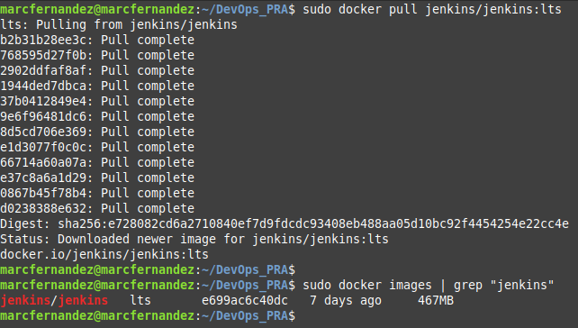

#### 2. Build and Run Jenkins Container

Create and run a Jenkins container **with privileges**:

```bash
sudo docker run --privileged -d -p 8080:8080 -p 50000:50000 -v jenkins_home:/var/jenkins_home --name jenkins jenkins/jenkins:lts
```

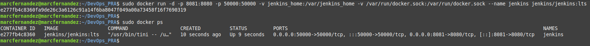

To pause the container:

```bash
docker pause jenkins
```
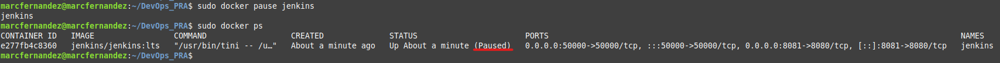

To resume:

```bash
docker unpause jenkins
```
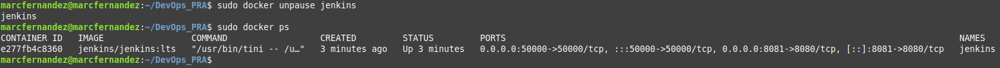

#### 3. Configure Jenkins Account

Access Jenkins at `http://localhost:8081` and follow the setup wizard. Retrieve the initial admin password from the Docker logs:

```bash
docker logs jenkins
```
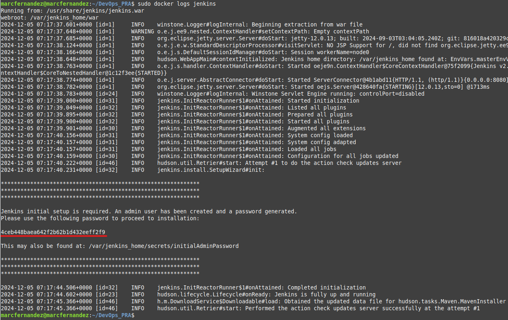

Create an admin account during the setup process.

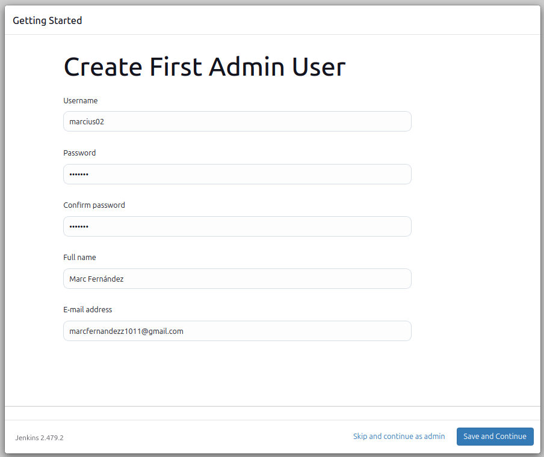


#### 3.1 Install Docker inside Jenkins: bash from host

Here's a summary of the steps to install Docker in a Jenkins container:

1. On the Linux host:
   
   ```bash
   sudo docker exec -it --user root jenkins bash
   ```
   This command accesses the Jenkins container's bash console.

2. Inside the Jenkins container:
   
   ```bash
   curl https://get.docker.com/ > dockerinstall && chmod 777 dockerinstall && ./dockerinstall
   ```
   This downloads and runs the Docker installation script.
 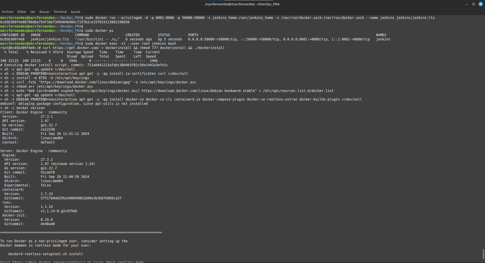  

3. Still inside the Jenkins container:
   
   ```bash
   usermod -aG docker jenkins
   ```
   
   This adds the Jenkins user to the Docker group.
   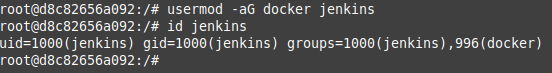

4. If permission issues persist, inside the Jenkins container:
   
   ```bash
   chmod 666 /var/run/docker.sock
   ```
   
   This changes the permissions of the Docker socket.
   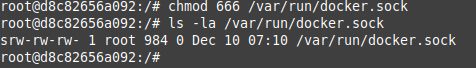

5. Back on the Linux host:
   
   ```bash
   docker restart jenkins2
   ```
   
   This restarts the Jenkins container to apply the changes.

Note that steps 2-4 are executed within the Jenkins container's bash, while steps 1 and 5 are performed on the Linux host machine.

#### 4. Install Basic Plugins

In Jenkins, go to "Manage Jenkins" > "Manage Plugins" and install these plugins:

- Maven Integration
- Git
- Docker
- SSH
- SonarQube Scanner

**Plugins** that are **already installed**: Git Client, Pipeline and Pipeline: Graph View.

**Available** plugins to **install**:

- Maven Integration
- Docker
- Docker Pipeline
- SSH
- SonarQube Scanner
- JDK Tool
- AWS Java SDK Secrets Manager
- AWS Java SDK ECS
- Amazon ECR

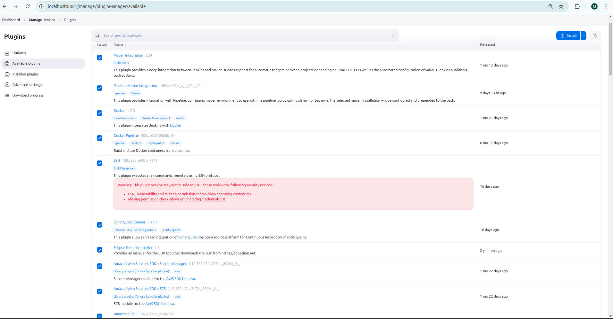

#### 4.1 Configure tools
JDK

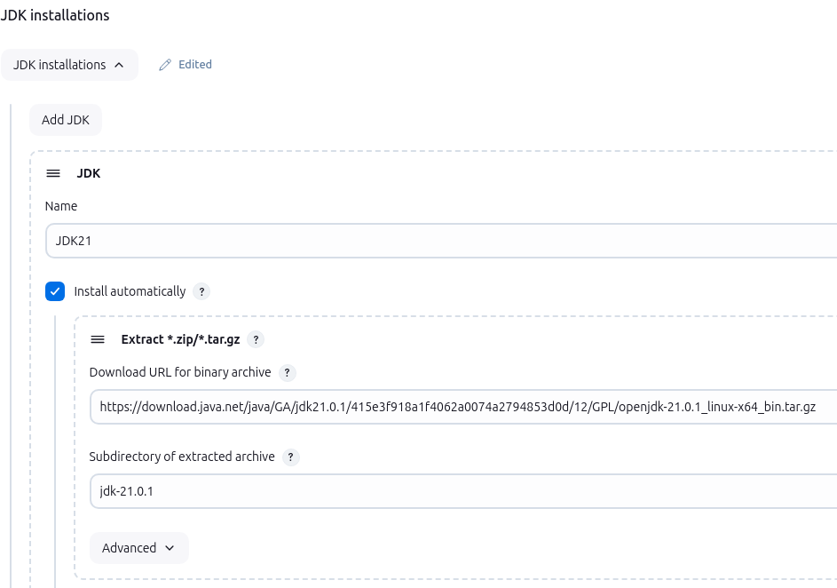

Git

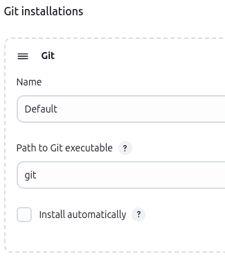

Maven

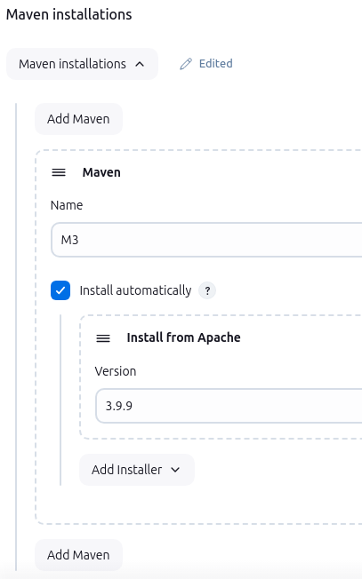

#### 5. Create a Pipeline for Spring Boot Project

Create a new pipeline job in Jenkins:

```groovy
pipeline {
    agent any
    
    environment {
        DOCKERHUB_CREDENTIALS = credentials('dockerhub_id')
        IMAGE_NAME = 'marcius02/bookspageable'
        IMAGE_TAG = "${BUILD_NUMBER}"
    }

    
    tools {
        maven 'M3'
        jdk 'JDK21'
    }

    stages {
        stage('Checkout') {
            steps {
                git 'https://github.com/AlbertProfe/BooksPageable.git'
            }
        }

        stage('Build') {
            steps {
                sh 'mvn clean package'
            }
        }

        stage('Archive') {
            steps {
             archiveArtifacts artifacts: '**/target/*.jar', fingerprint: true
            }
        }
        
        stage('Build Docker Image') {
            steps {
                script {
                    // Build the Docker image and tag it with both BUILD_NUMBER and latest
                    sh "docker build -t ${IMAGE_NAME}:${IMAGE_TAG} -t ${IMAGE_NAME}:latest ."
                }
            }
        }
        
        stage('Push to DockerHub') {
            steps {
                script {
                    // Login to DockerHub
                    sh "echo ${DOCKERHUB_CREDENTIALS_PSW} | docker login -u ${DOCKERHUB_CREDENTIALS_USR} --password-stdin"

                    // Push both the specific tag and the latest tag
                    sh "docker push ${IMAGE_NAME}:${IMAGE_TAG}"
                    sh "docker push ${IMAGE_NAME}:latest"
                }
            }
        }
    }
    
    post {
        always {
            // Logout from DockerHub and remove images
            sh "docker logout"
            sh "docker rmi ${IMAGE_NAME}:${IMAGE_TAG} || true"
            sh "docker rmi ${IMAGE_NAME}:latest || true"
        }
    }
    }
```


This Jenkins pipeline automates the process of building a Docker image for a Java project, pushing the image to DockerHub, and cleaning up afterward.

Docker Hub
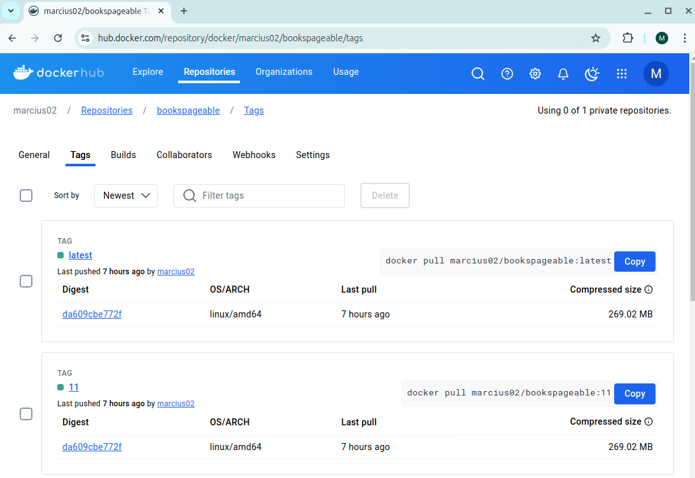

Status
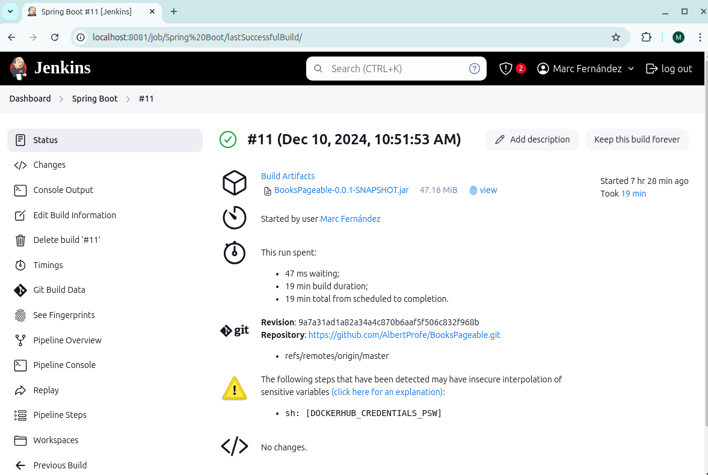

Timings
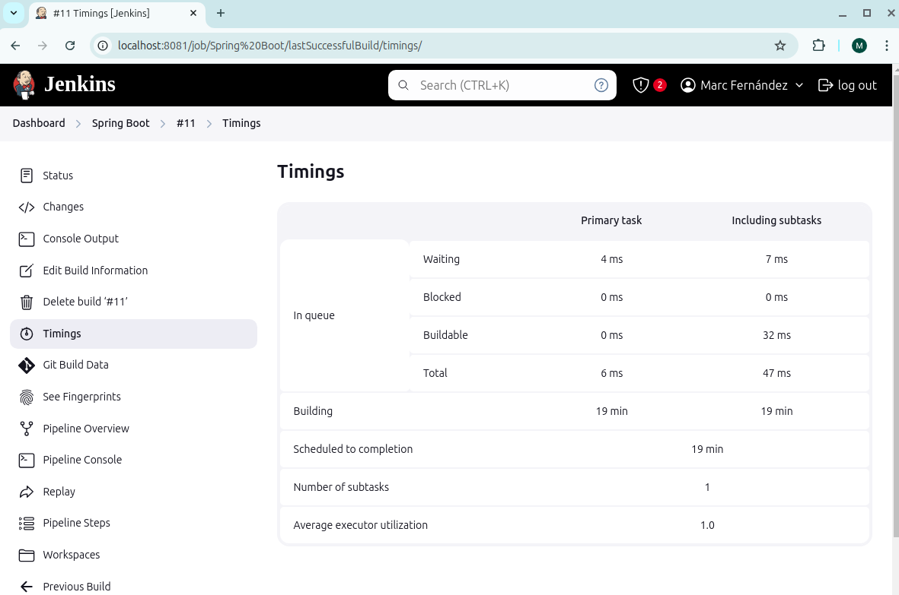

Build Data
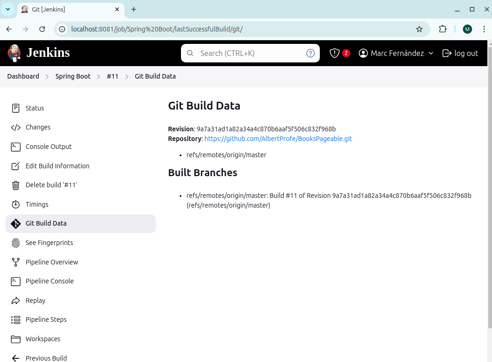

Pipe Overview
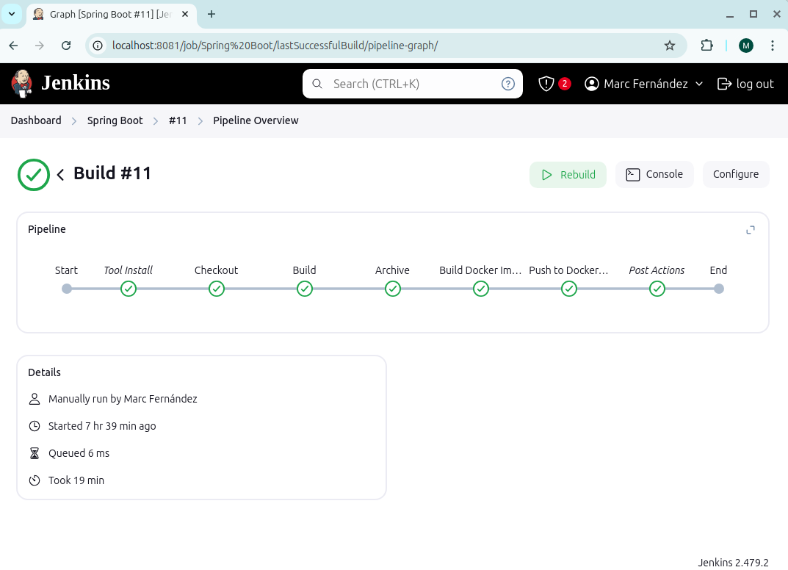

Pipe console


Workspace
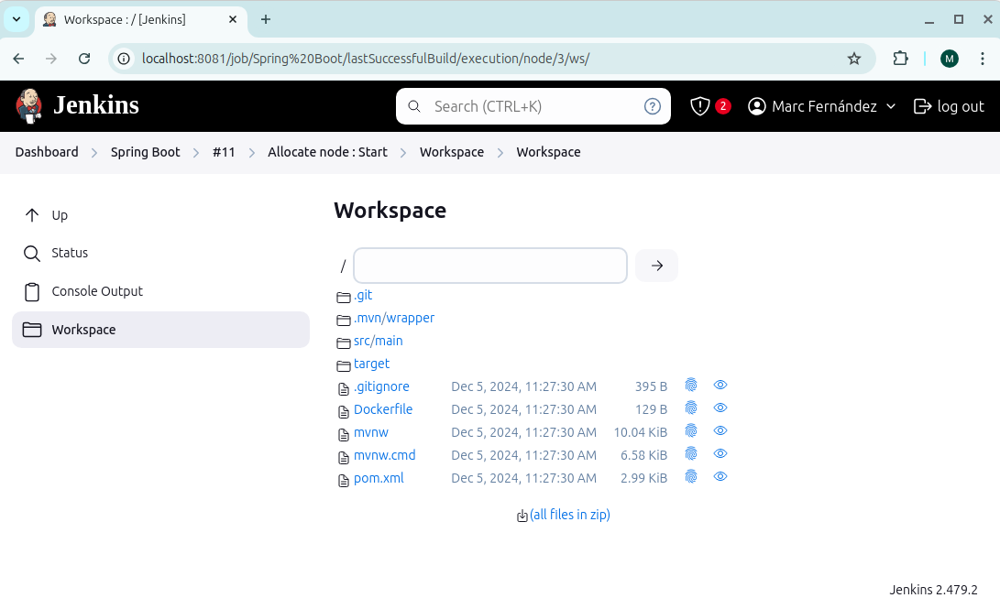