## MF06-PRA06: AWS Deployment for Spring Boot Docker Application

### CIFO La Violeta - DevOps IFCT0116-24 MF06

This practical exercise will guide you through setting up an AWS environment to deploy a Spring Boot Docker application created in MF05-PRA05, using AWS ECR, ECS, and Fargate.

### Tasks

#### 1. Create an AWS Account

1. Visit the AWS website and click "Create an AWS Account"
2. Follow the registration process, providing necessary information
3. Choose a support plan (Basic is free and sufficient for this exercise)

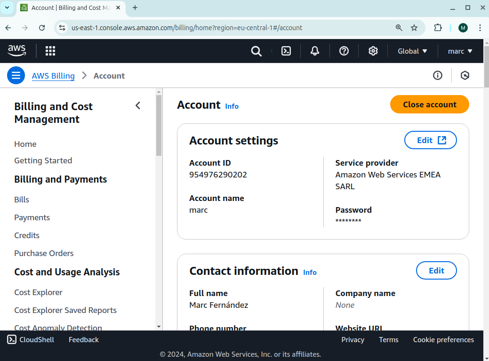

#### 2. Set Up AWS Budget and Billing Alerts

1. Navigate to AWS Budgets in the AWS Management Console
2. Click "Create budget" and choose "Customize (advanced)"
3. Select "Cost budget" and set a monthly fixed budget[5]
4. Configure alerts for 80% of your budgeted amount[5]
5. Set up an action to automatically apply an IAM policy restricting resource creation when the budget is exceeded[3]

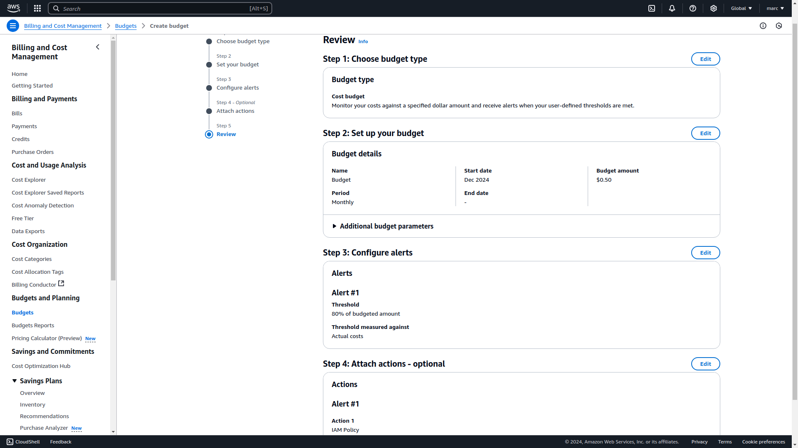


Having problems during the budget creation:
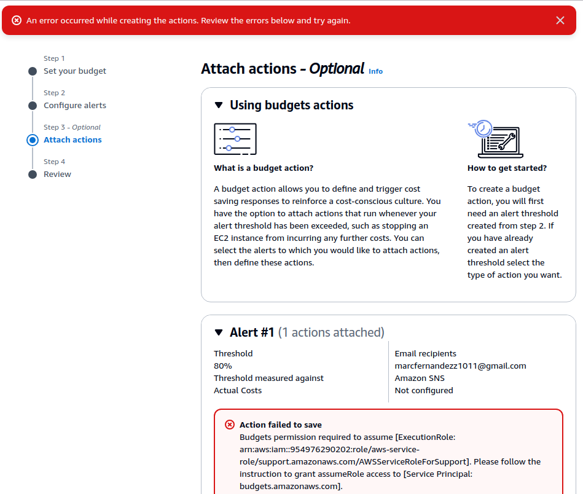


Solved by creating a role who has full access to AWS Budget Actions:
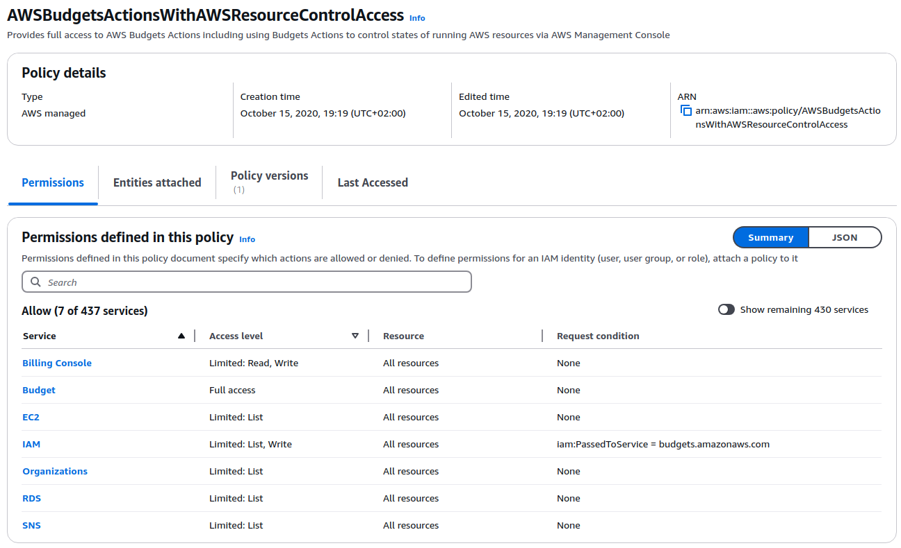


The budget has been created successfully:
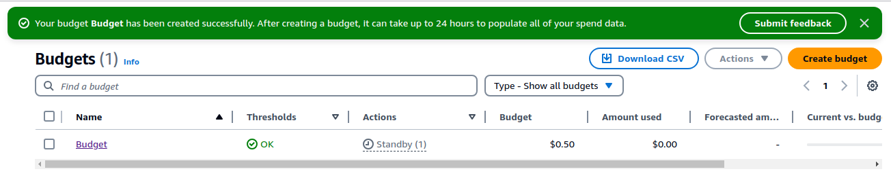

#### 3. Create AWS Services for Spring Boot Docker Deployment

##### Set up Amazon Elastic Container Registry (ECR)

1. Open the Amazon ECR console
2. Click "Create repository"
3. Name your repository (e.g., "spring-boot-app")
4. Configure repository settings and create

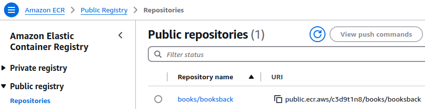

##### Configure Amazon Elastic Container Service (ECS)

1. Open the Amazon ECS console
2. Click "Create Cluster"
3. Choose "Networking only" for Fargate compatibility
4. Name your cluster and create

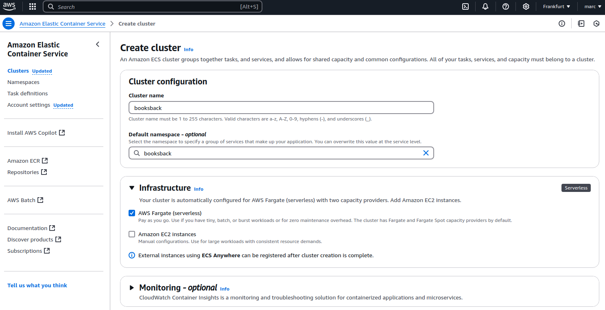

##### Set up AWS Fargate

1. In the ECS console, create a new task definition
2. Choose Fargate as the launch type
3. Configure task size (CPU and memory)
4. Add container details using the ECR image

New task definition:
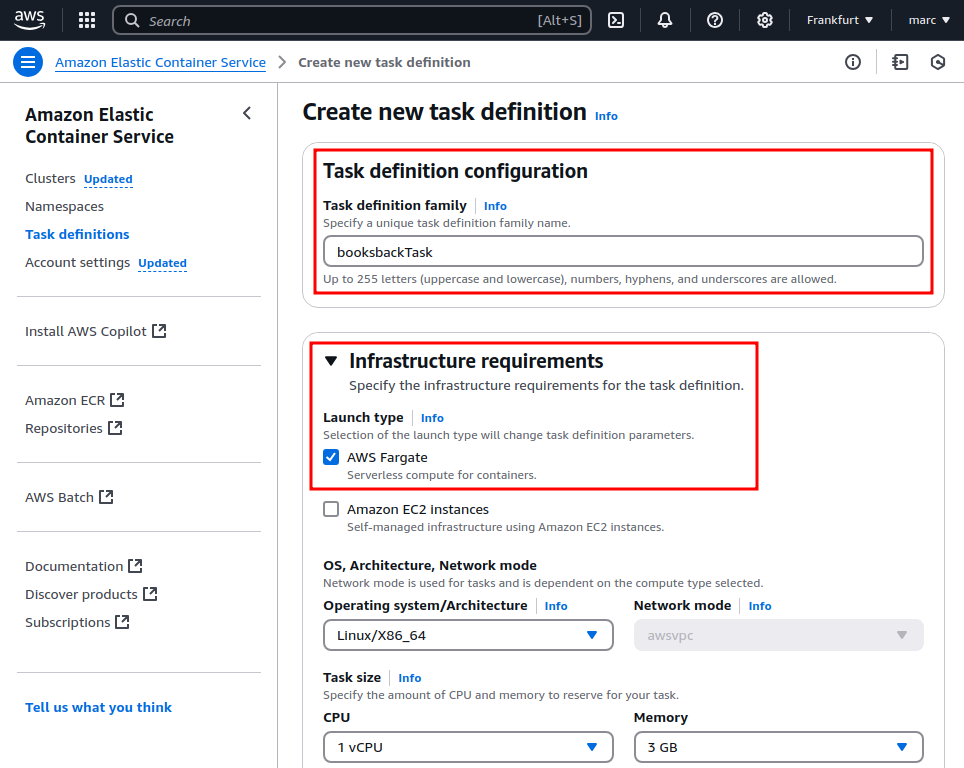

Container creation:
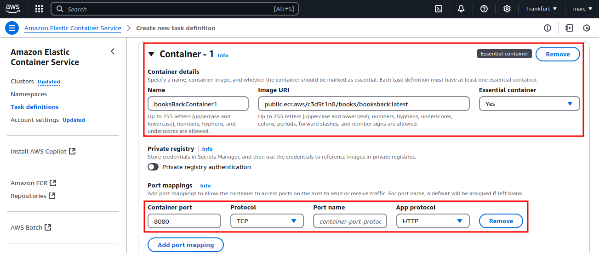

Service creation:
- Enviroment
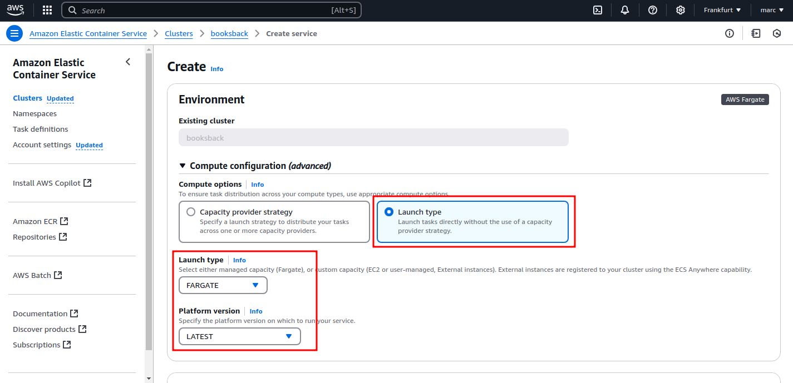

- Deployment
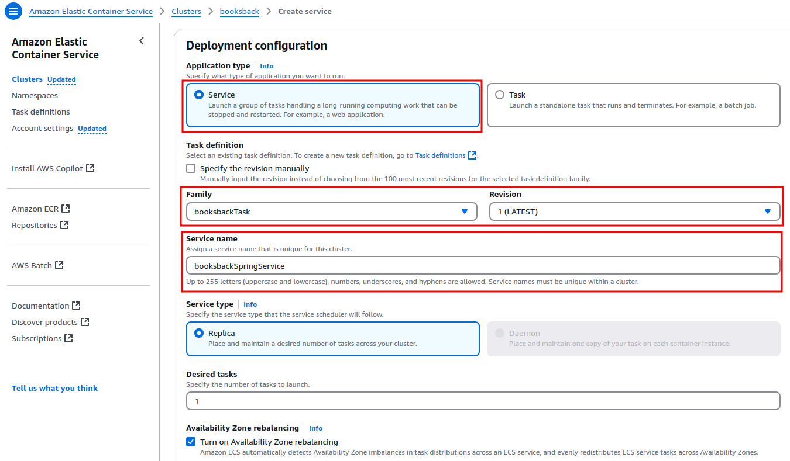

- Networking
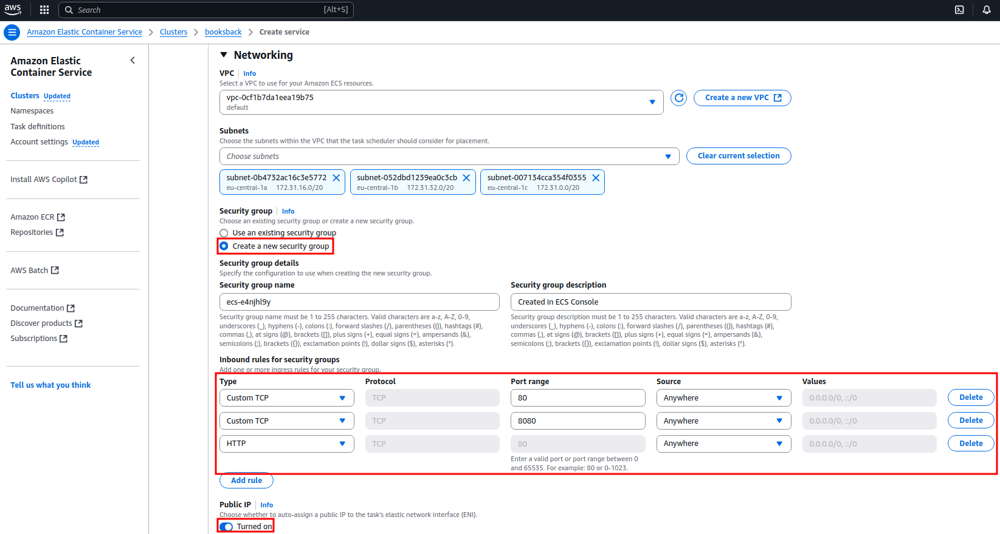

- Load Balancing
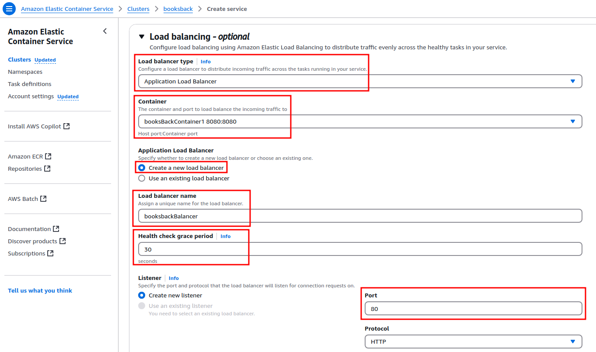
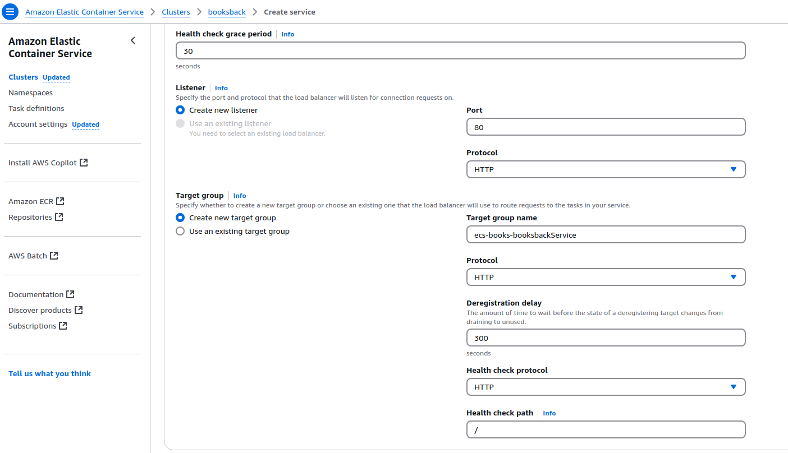


#### 4. Update Jenkins Pipeline for AWS Deployment

Modified Jenkins pipeline to include AWS deployment steps:

```groovy
pipeline {
    agent any
    
    environment {
        AWS_ACCOUNT_ID="954976290202"
        AWS_DEFAULT_REGION="eu-central-1"
        IMAGE_REPO_NAME="books/booksback"
        IMAGE_TAG="${env.BUILD_ID}"
        REPOSITORY_URI = "${AWS_ACCOUNT_ID}.dkr.ecr.${AWS_DEFAULT_REGION}.amazonaws.com/${IMAGE_REPO_NAME}"
        IMAGE_NAME = 'books/booksback'
    }

    
    tools {
        maven 'M3'
        jdk 'JDK21'
    }

    stages {
        stage('Checkout') {
            steps {
                git 'https://github.com/AlbertProfe/BooksPageable.git'
            }
        }

        stage('Build') {
            steps {
                sh 'mvn clean package'
            }
        }

        stage('Archive') {
            steps {
             archiveArtifacts artifacts: '**/target/*.jar', fingerprint: true
            }
        }
        
        stage('Build Docker Image') {
            steps {
                script {
                    // Build the Docker image and tag it with both BUILD_NUMBER and latest
                    sh "docker build -t ${IMAGE_NAME}:${IMAGE_TAG} -t ${IMAGE_NAME}:latest ."
                }
            }
        }
        
        stage('Push to ECR') {
            steps {
                script {
                    sh "aws ecr-public get-login-password --region eu-central-1 | docker login --username AWS --password-stdin public.ecr.aws/c3d9t1n8"
                    sh "docker tag ${IMAGE_REPO_NAME}:${IMAGE_TAG} ${REPOSITORY_URI}:${IMAGE_TAG}"
                    sh "docker push ${REPOSITORY_URI}:${IMAGE_TAG}"
                }
            }
        }

        stage('Deploy to ECS') {
            steps {
                script {
                    sh "aws ecs update-service --cluster booksback --booksbackSpringService --force-new-deployment"
                }
            }
        }
    }
    
    post {
        always {
            // Logout from DockerHub and remove images
            sh "docker logout"
            sh "docker rmi ${IMAGE_NAME}:${IMAGE_TAG} || true"
            sh "docker rmi ${IMAGE_NAME}:latest || true"
        }
    }
    }
```

#### 5. Deploy Spring Boot Application

1.Access key creation:
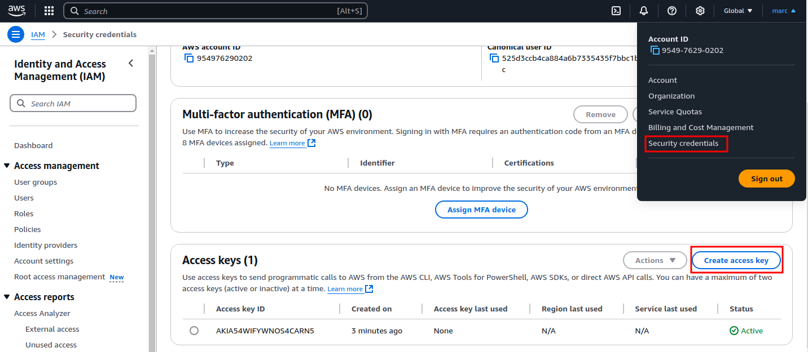


2.Errors and Changes

Error 1:
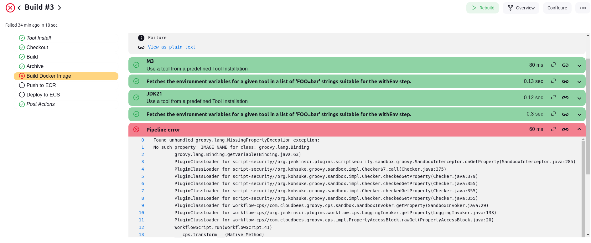

Change:
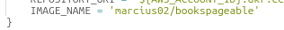


Error 2:
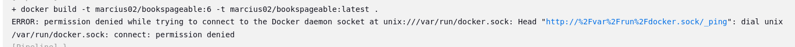

Change:
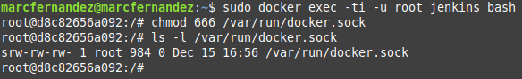


Error 3:
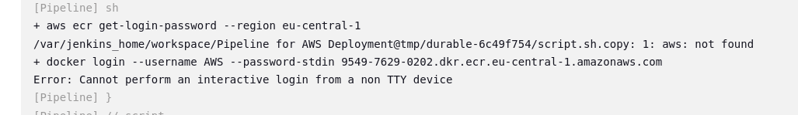

Changes:
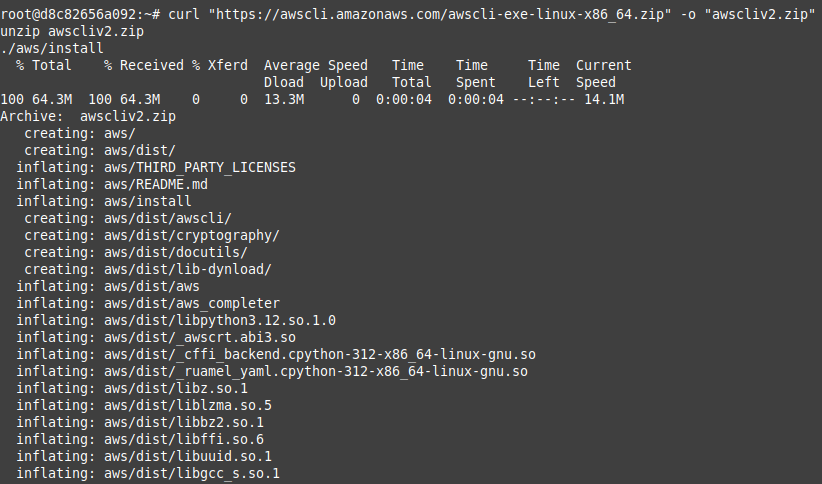

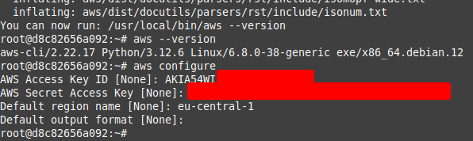


Error 4:
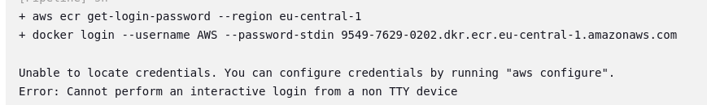

Change:
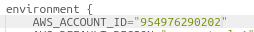


I could not find a solution yet.